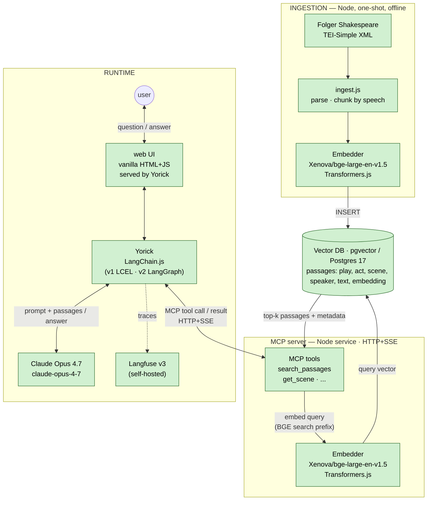

# Braindump

## Transformers

I've decided to go with the local transformer /bge-large-en-v1.5/ instead of VoyageAI or OpenAI.

## Stack constraint

**JS + Node end-to-end.** Ingestion uses Transformers.js loading the ONNX build of BGE-large, so ingest-side and query-side share an embedding space in a single Node runtime. Ingest script is plain JS; Yorick and web UI may move to TypeScript when written.

## MCP boundary

The retrieval layer (embedder + pgvector search) lives behind an **MCP server**, exposed over **HTTP+SSE**. Yorick (the agent) doesn't touch pgvector or the embedder directly — it calls MCP tools (`search_passages`, `get_scene`, etc.) like any other tool. One tool surface, many possible clients: Yorick, Claude Code from the terminal, Claude Desktop, future experiments. The MCP server is its own service in `compose.yml`.

## System diagram (final stage)

Green = tool chosen. Orange = piece needed, tool TBD.

### Notes on the diagram

- The embedder model is shared between ingestion and the MCP server — same vector space on both sides. Changing the model means re-embedding the whole corpus AND restarting the MCP server.
- The MCP server owns query embedding. Yorick never sees a vector; it asks `search_passages("…borrowed and lender…")` and gets back passages with metadata.
- BGE-v1.5 expects a query prefix: `"Represent this sentence for searching relevant passages: "`. That prefix is applied inside the MCP server's `search_passages` implementation, not Yorick.
- HTTP+SSE was chosen over stdio so the MCP server can be a peer service in `compose.yml` reachable by multiple clients (Yorick, Claude Code via `.claude/settings.json`, Claude Desktop). Stdio would scope it to a single parent process.
- Observability hangs off Yorick. The interesting trace is: question → MCP tool calls → returned passages → prompt → LLM call → answer.
- The **web UI and Yorick share one Node process** — the `yorick` compose service serves both the static HTML+JS page (`GET /`) and the SSE endpoint (`POST /ask`). The UI is shown as a separate node only because conceptually it's a different concern (browser-side rendering vs server-side orchestration).
- **Langfuse v3 self-hosted** adds 6 supporting services to `compose.yml`: `langfuse-web`, `langfuse-worker`, `langfuse-postgres`, `clickhouse`, `redis`, `minio`. Total stack goes from 3 to 9 services. Auto-bootstraps an admin user + org + project + API keys on first boot via `LANGFUSE_INIT_*` env vars — no manual setup. Yorick wires it in with two npm packages (`langfuse`, `langfuse-langchain`) and one callback handler passed to `chain.stream({...}, { callbacks: [langfuse] })`.

### Decisions (all resolved)

1. ~~**Yorick's harness**~~ — **LangChain.js**. v1: LCEL RAG chain. v2: LangGraph agent with MCP tools (when MCP server lands).
2. ~~**LLM**~~ — **Claude Opus 4.7** (`claude-opus-4-7`).
3. ~~**Web UI**~~ — **Vanilla HTML+JS**, no framework, no build, served by the `yorick` service. SSE-format frames over POST.
4. ~~**Observability**~~ — **Langfuse v3 self-hosted** in `compose.yml`. Six supporting services. Trade-off: ~1.5–2 GB extra RAM, ~60–90s cold start.
5. ~~**MCP transport**~~ — **HTTP+SSE**, MCP server as a peer service in compose.
